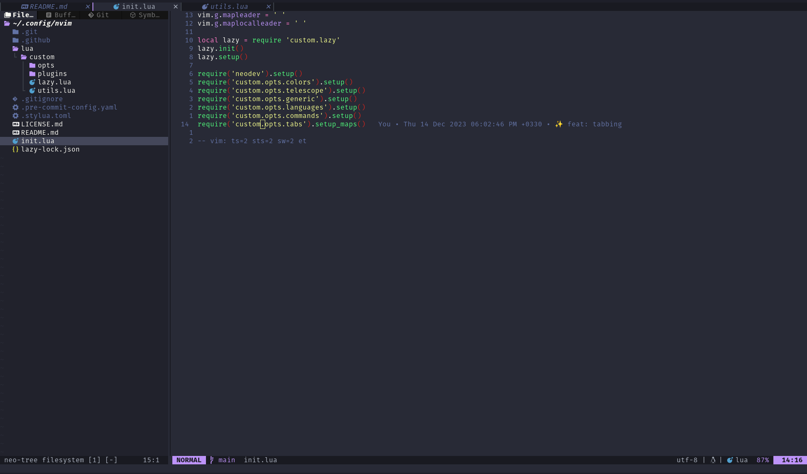

# My NVIM configuration

[](https://results.pre-commit.ci/latest/github/mhkarimi1383/nvim/main)



> Based on [kickstart.nvim](https://github.com/nvim-lua/kickstart.nvim)

### Installation

> **NOTE**
> Backup your previous configuration (if any exists)

Requirements:
* Make sure to review the readmes of the plugins if you are experiencing errors. In particular:
  * [ripgrep](https://github.com/BurntSushi/ripgrep#installation) is required for multiple [telescope](https://github.com/nvim-telescope/telescope.nvim#suggested-dependencies) pickers.
* See [Windows Installation](#Windows-Installation) if you have trouble with `telescope-fzf-native`

Neovim's configurations are located under the following paths, depending on your OS:

| OS | PATH |
| :- | :--- |
| Linux | `$XDG_CONFIG_HOME/nvim`, `~/.config/nvim` |
| MacOS | `$XDG_CONFIG_HOME/nvim`, `~/.config/nvim` |
| Windows (cmd)| `%userprofile%\AppData\Local\nvim\` |
| Windows (powershell)| `$env:USERPROFILE\AppData\Local\nvim\` |

Clone this project:

```sh
# on Linux and Mac
git clone https://github.com/mhkarimi1383/nvim.git "${XDG_CONFIG_HOME:-$HOME/.config}"/nvim
```


```
# on Windows (cmd)
git clone https://github.com/mhkarimi1383/nvim.git %userprofile%\AppData\Local\nvim\
```

```
# on Windows (powershell)
git clone https://github.com/mhkarimi1383/nvim.git $env:USERPROFILE\AppData\Local\nvim\
```


### Post Installation

Start Neovim

```sh
nvim
```

The `Lazy` plugin manager will start automatically on the first run and install the configured plugins - as can be seen in the introduction video. After the installation is complete you can press `q` to close the `Lazy` UI and **you are ready to go**! Next time you run nvim `Lazy` will no longer show up.

If you would prefer to hide this step and run the plugin sync from the command line, you can use:

```sh
nvim --headless "+Lazy! sync" +qa
```

### Recommended Setup

Font: `Inconsolata Nerd Font Mono`
Terminal: `kitty` (with my custom setup at https://github.com/mhkarimi1383/kitty)

### Configuration And Extension

add/modify any required plugin in `lua/custom/plugins/`

this directory is included in `init.lua` by default

You can also merge updates/changes from the repo back into your fork, to keep up-to-date with any changes for the default configuration.

Also inside `init.lua` you can see that nothing has been written directly and we have tried to make this configuration modular with the help of lua modules, etc.
So, do not forget to follow this style :)


### Contribution

1. Fork this project
2. Create a branch for your changes
3. Create PR

### Windows Installation

Installation may require installing build tools, and updating the run command for `telescope-fzf-native`

See `telescope-fzf-native` documentation for [more details](https://github.com/nvim-telescope/telescope-fzf-native.nvim#installation)

This requires:

- Install CMake, and the Microsoft C++ Build Tools on Windows

```lua
{'nvim-telescope/telescope-fzf-native.nvim', build = 'cmake -S. -Bbuild -DCMAKE_BUILD_TYPE=Release && cmake --build build --config Release && cmake --install build --prefix build' }
```
